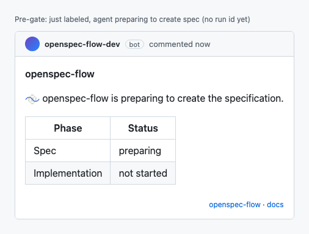
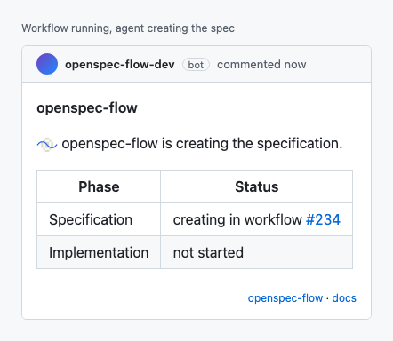
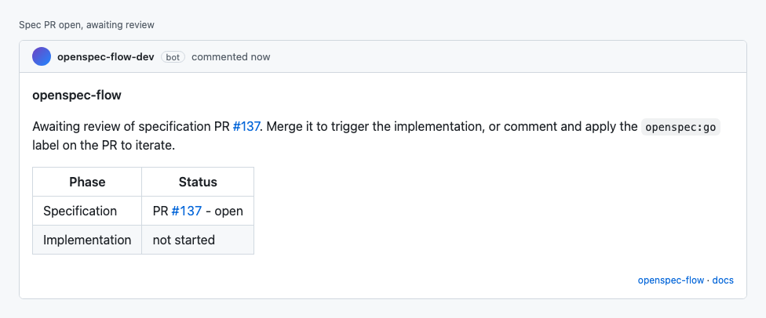
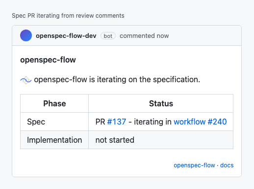
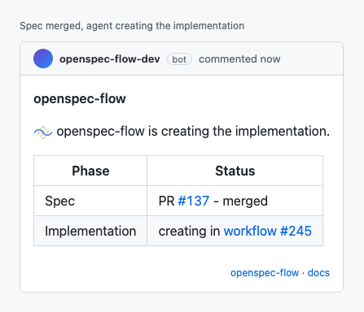
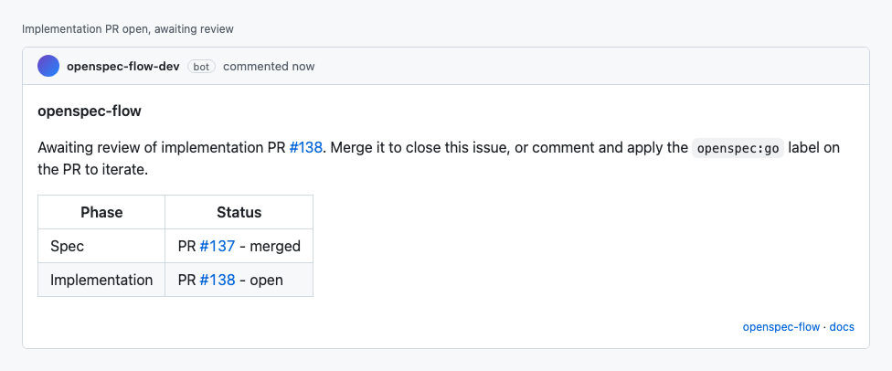
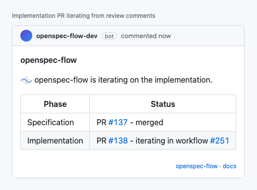
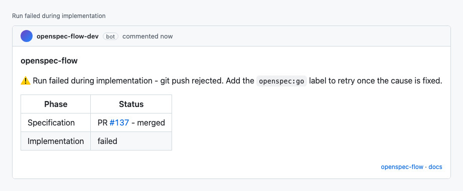
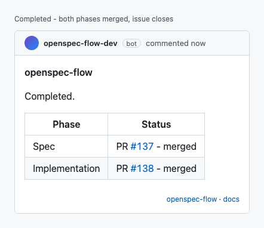

<p align="center">
  <h2 align="center">openspec-flow</h2>
  <h3 align="center">Drive OpenSpec spec-driven development from GitHub issues.</h3>
  <p align="center">
    Label an issue. Get a spec PR. Merge it. Get an implementation PR.
  </p>
  <p align="center">
    <a href="https://github.com/dwmkerr/openspec-flow/releases"></a>
    <a href="https://github.com/dwmkerr/openspec-flow/actions/workflows/cicd.yaml"></a>
    <a href="https://github.com/sponsors/dwmkerr"></a>
  </p>
</p>

## Quickstart

1. **Install openspec-flow** via the GitHub App or the CLI — see the [installation guide](#install) below.
2. **Label an issue** with `openspec:go`.
3. **A specification PR opens automatically**, labelled `openspec:spec`. Review it, leave comments. Re-apply `openspec:go` on the PR to update the spec based on the discussion. Merge when ready.
4. **An implementation PR is raised**, labelled `openspec:impl`. Re-apply `openspec:go` after comments to improve the implementation. Merge to ship — the original issue closes automatically.

## Install

### Install the GitHub App (recommended)

[**openspec-flow on the GitHub Apps marketplace**](https://github.com/apps/openspec-flow)

When the App is installed, feedback on issues and pull requests showing the current stage of openspec-flow's operations is **real time**. A pull request opens automatically containing the workflow shim that drives the flow, along with instructions for setting the required secrets. Merge it and the flow is live.

### Shim it yourself (when you can't install the App)

If you can't install the App, install the CLI and let it scaffold the same machinery as a pull request:

```bash
npx @dwmkerr/openspec-flow install
```

Feedback on issues and pull requests happens during the workflow run, so updates lag by ~30 seconds while the runner spins up. The CLI explains how to create the three contract labels (`openspec:go`, `openspec:spec`, `openspec:impl`) and how to set the required Anthropic API key secret. Same workflow, same flow.

## How it works

A single sticky comment lives on the issue, mirrored to every PR raised for the flow. It updates as the agent works so you always know where you are and what to do next.

| Step | What you see | What to do next |
|---|---|---|
| **1. You label the issue** with `openspec:go`. The bot acknowledges within ~1 second (App) or as soon as the workflow runner spins up (shim, ~30s). |  | Nothing — the agent is starting. |
| **2. The agent is drafting the specification.** The active row shows what it's doing right now (`gathering context`, `pushing`, etc) and which workflow run to watch. |  | Nothing — wait for the spec PR. |
| **3. The specification PR is ready for review.** |  | Review the PR. Merge to advance to implementation, or comment + re-apply `openspec:go` on the PR to iterate. |
| **4. You commented and re-applied `openspec:go`.** The agent is updating the spec PR based on the discussion. |  | Wait for the iteration to land, then review again. |
| **5. You merged the spec PR.** The agent is drafting the implementation. |  | Nothing — wait for the implementation PR. |
| **6. The implementation PR is ready for review.** |  | Review the code. Merge to close the issue, or comment + re-apply `openspec:go` to iterate. |
| **7. You commented and re-applied `openspec:go`** on the implementation PR. |  | Wait for the iteration, then review again. |
| **8. Something went wrong.** The comment surfaces the warning + reason. |  | Click through to the workflow run for details. Apply `openspec:go` after fixing the cause to retry. |
| **9. You merged the implementation PR.** The flow is complete; the original issue closes automatically. |  | Nothing — done. |

## Develop

See [`docs/developer-guide.md`](./docs/developer-guide.md). Built on [OpenSpec](https://github.com/Fission-AI/OpenSpec) + Claude Agent SDK. Architecture in [`docs/architecture.md`](./docs/architecture.md).

```bash
npm install
cp .env.example .env
npm run dev:tunnel    # terminal 1
npm run dev           # terminal 2
```

## License

MIT.
