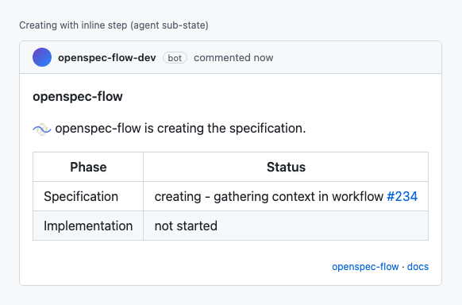
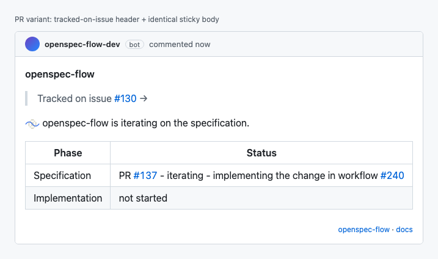
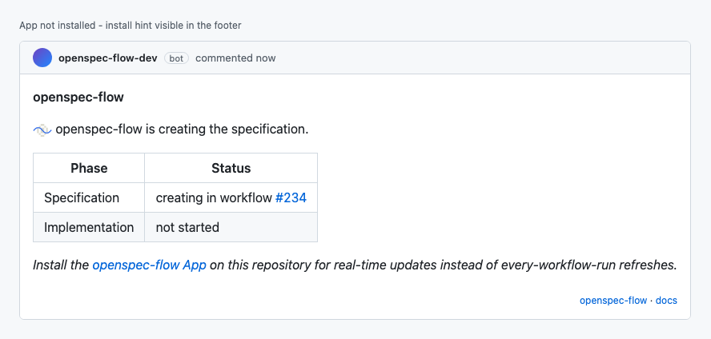

<p align="center">
  <h2 align="center"><code>📐 openspec-flow</code></h2>
  <h3 align="center">Drive OpenSpec spec-driven development from GitHub issues.</h3>
  <p align="center">
    Label an issue. Get a spec PR. Merge it. Get an implementation PR.
  </p>
</p>

## How it works

1. **Label an issue** with `openspec:go`.
2. **A specification PR opens automatically.** Review it, comment, or push back. Re-apply `openspec:go` on the PR to update the spec based on the discussion. Merge when you're happy with it.
3. **An implementation PR is raised**, which archives the change. Re-apply `openspec:go` on this PR after comments or discussion to improve the implementation.
4. **Merge the implementation PR.** The original issue closes automatically.

You apply one label. The bot applies the rest.

| Label | Applied by | Meaning |
|---|---|---|
| `openspec:go` | **you** | Trigger. Add to an issue to start; add to a PR to re-run iteration. |
| `openspec:spec` | bot | Specification PR — review the proposal, then merge. |
| `openspec:impl` | bot | Implementation PR — review the code, then merge to ship. |

## The sticky comment

A single comment lives on the issue, mirrored to every PR raised for the flow. It updates as the agent works so you always know where you are and what to do next.

| Step | What you see | What to do next |
|---|---|---|
| **1. You label the issue** with `openspec:go`. The bot acknowledges within ~1 second (App) or as soon as the workflow runner spins up (shim, ~30s). |  | Nothing — the agent is starting. |
| **2. The agent is drafting the specification.** The workflow has started; the row tells you which run to watch. |  | Nothing — wait for the spec PR. |
| **3. The specification PR is ready for review.** |  | Review the PR. Merge to advance to implementation, or comment + re-apply `openspec:go` on the PR to iterate. |
| **4. You commented and re-applied `openspec:go`.** The agent is updating the spec PR based on the discussion. |  | Wait for the iteration to land, then review again. |
| **5. You merged the spec PR.** The agent is drafting the implementation. |  | Nothing — wait for the implementation PR. |
| **6. The implementation PR is ready for review.** |  | Review the code. Merge to close the issue, or comment + re-apply `openspec:go` to iterate. |
| **7. You commented and re-applied `openspec:go` on the implementation PR.** |  | Wait for the iteration, then review again. |
| **8. Something went wrong.** The comment surfaces the warning + reason. |  | Click through to the workflow run. Apply `openspec:go` after fixing the cause to retry. |
| **9. You merged the implementation PR.** The flow is complete; the original issue closes automatically. |  | Nothing — done. |

### Variations

| What | Why | Screenshot |
|---|---|---|
| **Inline agent step** | The active row shows what the agent is doing right now — `gathering context`, `implementing the change`, `pushing` — so you don't have to click through to the workflow run. |  |
| **Mirrored on the pull request** | The same comment is mirrored to every PR raised for the flow, prefixed with a link back to the originating issue. |  |
| **Without the App installed** | The shim variant carries a discreet hint pointing at the App for real-time feedback. Everything else operates identically. |  |

## Install

### Install the GitHub App (recommended)

[**openspec-flow on the GitHub Apps marketplace**](https://github.com/apps/openspec-flow)

Install on a repository. A pull request opens automatically containing the workflow shim that drives the flow, along with instructions for setting the required secrets. Merge it and the flow is live.

### Shim it yourself (when you can't install the App)

If you can't install the App, install the CLI and let it scaffold the same machinery as a pull request:

```bash
npx @dwmkerr/openspec-flow install
```

The CLI explains how to create the three contract labels (`openspec:go`, `openspec:spec`, `openspec:impl`) and how to set the required Anthropic API key secret. Same workflow, same flow.

**App vs shim trade-off**: with the App, comment updates are **real time**. With the shim, updates happen during the workflow run, so feedback lags by ~30 seconds while the runner spins up. Both modes operate identically beyond that.

## Develop

See [`docs/developer-guide.md`](./docs/developer-guide.md). Built on [OpenSpec](https://github.com/Fission-AI/OpenSpec) + Claude Agent SDK. Architecture in [`docs/architecture.md`](./docs/architecture.md).

```bash
npm install
cp .env.example .env
npm run dev:tunnel    # terminal 1
npm run dev           # terminal 2
```

## License

MIT.
